  

  

<table align="center">
<tr>
<td width="50%" valign="top">

<code>ES</code>

**Desarrollador empresarial de C-suite.**
Trabajo donde se cruzan la estrategia y el código: convierto decisiones de dirección en sistemas que funcionan solos.

— visión de negocio, ejecución técnica 
— menos ruido, más señal 
— construir en silencio

</td>
<td width="50%" valign="top">

<code>EN</code>

**C-suite business developer.**
I work where strategy meets code: turning executive decisions into systems that run on their own.

— business vision, technical execution 
— less noise, more signal 
— building quietly

</td>
</tr>
</table>

  
  

  

  

  
  

<code>— hecho en la penumbra · made in the dark —</code>

